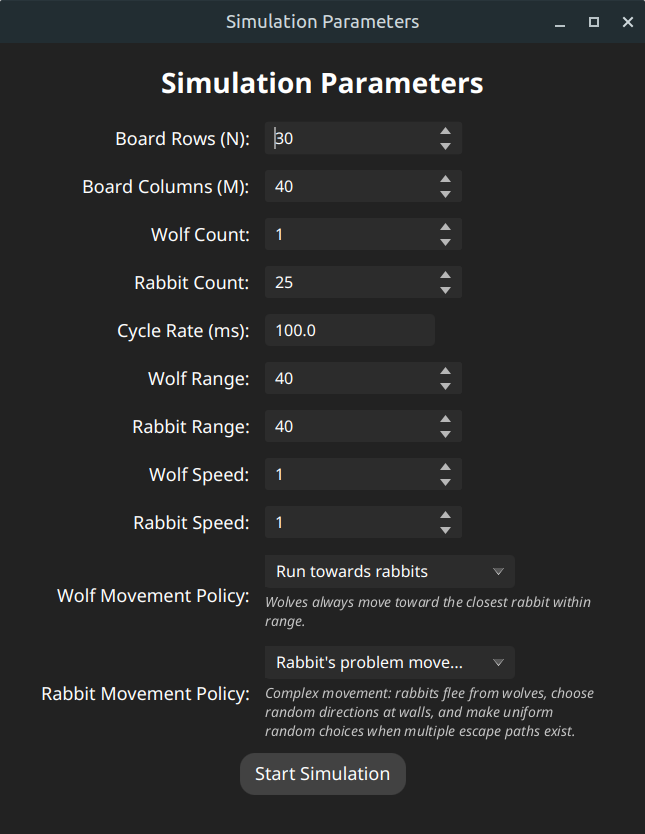
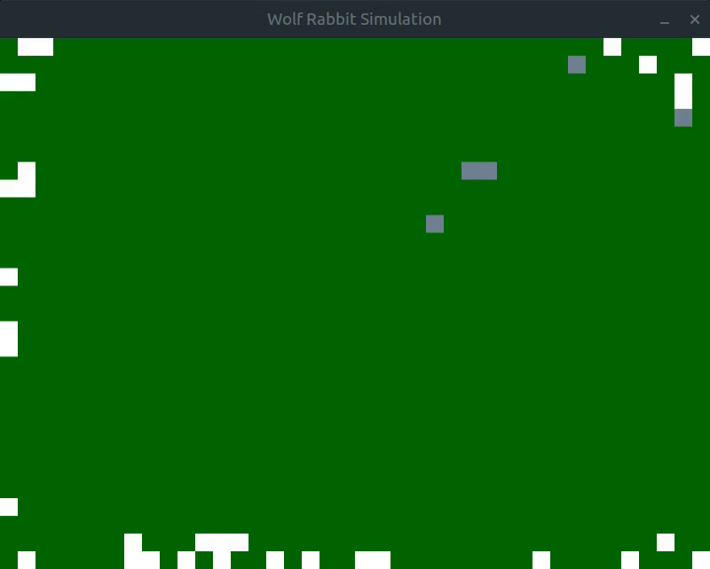

# Wolf & Rabbit Simulation: A Digital Ecosystem (of sorts)

Welcome to a 2D simulation where digital wolves chase digital rabbits. It's built with Java and JavaFX, because someone had to.





## Overview

This project bravely attempts to simulate the thrilling (or perhaps, mildly interesting) interactions between wolf and rabbit populations. You, the user, get to play god by tweaking various parameters before unleashing the chaos.

## Features

*   **Highly Configurable Parameters (Don't get too wild)**:
    *   Set the starting lineup: How many wolves? How many rabbits? The fate of pixels is in your hands.
    *   Fiddle with the "cycle rate" – it's like a tempo knob for the simulation's pace.
    *   Define the arena: How big is this digital battlefield (N x M)?
    *   Adjust speed, "range" (whatever that means in this context), and initial numbers for both predator and prey.

*   **Wolf Behavior (They're trying their best)**:
    *   **Movement "Policies"**:
        *   They can be programmed to lumber towards the nearest rabbit. Groundbreaking.
        *   If a rabbit is within what we call "range," the wolf might, just might, "eat" it.
    *   **Post-Meal Siesta**: Wolves can be configured to take a little break after a successful hunt. Even apex predators need to digest.
    *   **Interactive Pause Button (for Wolves)**: Click a wolf. It stops. Click it again. It moves. The pinnacle of user engagement.

*   **Rabbit Behavior (Masters of Evasion... sometimes)**:
    *   **Movement "Policies"**:
        *   **Policy A (The Obvious One)**: Always scurry away from the nearest wolf. A classic.
        *   **Policy B (The "It's Complicated" One)**:
            *   Tries to flee from wolves. If the escape route is clear, off it goes.
            *   If blocked, it contemplates its existence and stays put.
            *   If it hits a wall (the edge of the board), it panics and picks a random direction. Genius.
    *   **Interactive Pause Button (for Rabbits)**: Because equality. Click a rabbit to make it freeze. Click to release.

*(To pause the simluation, hold control and click on the board, do the same to resume.)*

## Running the Project (Good luck!)

To witness this marvel of modern computing:

1.  You'll need a Java Development Kit (SDK) and JavaFX. Ensure they're compatible, or don't. Surprises are fun.
2.  The `run.sh` script is your friend (or foe, depending on your setup).

### On Linux:

1.  Open your terminal and navigate to where you bravely cloned this repository.
2.  Grant the script permission to run, because security:
    ```sh
    chmod +x run.sh
    ```
3.  Cross your fingers and run:
    ```sh
    ./run.sh
    ```
    *(The script currently believes JavaFX SDK 17.0.15 lives at `/opt/javafx-sdk-17.0.15/lib`. If your reality differs, you might need to have a little chat with the `JAVAFX_PATH` variable inside `run.sh`.)*

### On Windows

Good luck on your own.

## Contributing 

You can go ahead and create a pull request. Make yourself look good as if you are contributing to the open source.